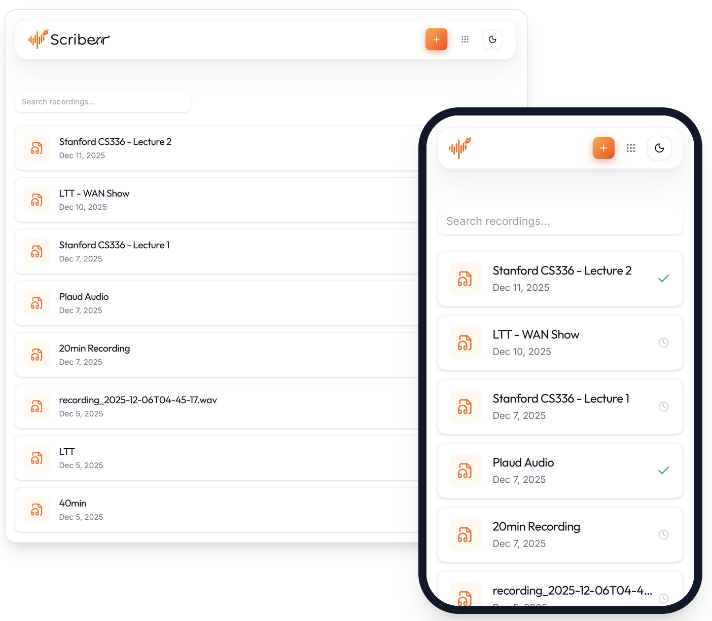
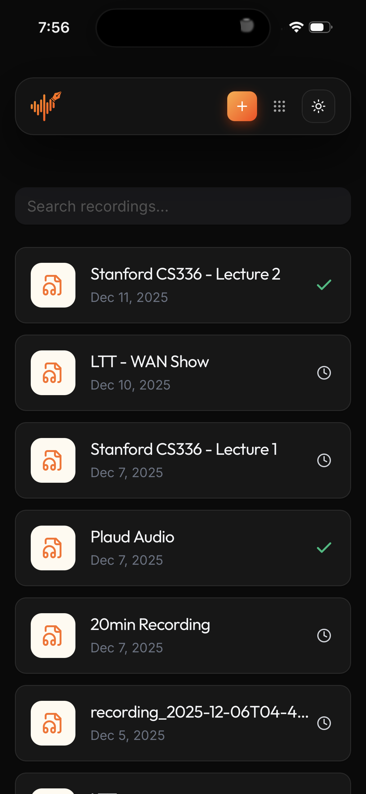
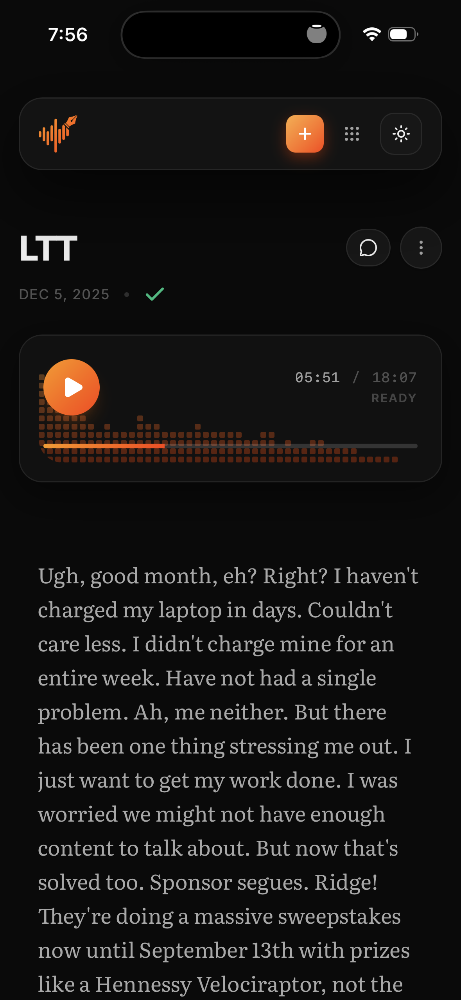

<div align="center">
  
  
</div>
</br>
</br>
<p align="center">
Scriberr is an open-source, and completely offline audio transcription application designed for self-hosters who value privacy and performance.
</p>

<p align="center">
  <a href="https://scriberr.app">Website</a> •
  <a href="https://scriberr.app/docs/">Docs</a> •
  <a href="https://scriberr.app/api">API Reference</a>
</p>

<p align="center">
<a href='https://ko-fi.com/H2H41KQZA3' target='_blank'></a>
</p>

<div align="center">
  
</div>

## Sponsors

 Meeting Transcription API   
If you're looking for a transcription API for meetings, consider checking out [Recall.ai](https://www.recall.ai/?utm_source=github&utm_medium=sponsorship&utm_campaign=rishikanthc-scriberr), an API that works with Zoom, Google Meet, Microsoft Teams, and more.
Recall.ai diarizes by pulling the speaker data and seperate audio streams from the meeting platforms, which means 100% accurate speaker diarization with actual speaker names.

## Introduction

At its core, Scriberr allows you to transcribe audio and video locally on your machine, ensuring no data is ever sent to a third-party cloud provider.
Leveraging state-of-the-art machine learning models (such as **NVIDIA Parakeet**, and **Canary**) or the older more popular **Whisper** models, it delivers high-accuracy text with word-level timing.

Scriberr goes beyond simple transcription and provides various advanced capabilities.
It combines powerful under-the-hood AI with a polished, fluid user interface that makes managing your recordings feel effortless. Whether you are sorting through voice notes or analyzing long meetings, Scriberr provides a beautiful environment to get work done:

- **Smart Speaker Detection**: Scriberr automatically detects different speakers (Diarization) and labels exactly who said what.
- **Chat with your Audio**: Connect seamlessly with Ollama or OpenAI API compatible providers. You can generate summaries, ask questions, or have a full conversation with your transcripts right inside the app.
- **Built for your Workflow**: With extensive APIs and Folder Watcher that automatically processes new files in a folder, Scriberr fits right into your existing automations (like n8n).
- **Capture & Organize**: Use the built-in audio recorder to capture thoughts on the fly, and the integrated note-taking features to annotate your transcripts as you listen.
- **Native Experience everywhere**: Scriberr supports PWA (Progressive Web App) installation, giving you a native app experience on your desktop or mobile device.
- **A Polished UI**: I’ve focused on the little UI niceties that make the app feel responsive and satisfying to use.

[View full list of features →](https://scriberr.app/docs/features)

### Why I built this

The inspiration for Scriberr was born out of privacy paranoia and not wanting to pay for subscription.
About a year ago, I purchased a [Plaud Note](https://www.plaud.ai/) for recording voice memos. I loved the device itself; the form factor, microphone quality, and workflow were excellent.

- Accurate transcription with word‑level timing
- Speaker diarization (identify and label speakers)
- Transcript reader with playback follow‑along and seek‑from‑text
- Highlights and lightweight note‑taking (jump note → audio/transcript)
- Summarize and chat over transcripts (OpenAI or local models via Ollama)
- Transcription profiles for re‑usable configurations
- YouTube video transcription (paste a link and transcribe)
- **CSV Batch Import** - Import a CSV list of YouTube URLs for sequential batch transcription
- Quick transcribe (ephemeral) and batch upload
- REST API coverage for all major features + API key management
- Download transcripts as JSON/SRT/TXT (and more)
- Support for Nvidia GPUs [New - Experimental]

However, transcription was done on their cloud servers. As someone who is paranoid about privacy I wasn't comfortable with uploading my recordings to a third party provider.
Moreover I was hit with subscription costs: $100 a year for 20 hours of transcription per month, or $240 a year for unlimited access. As an avid self-hoster with a background in ML and AI, it felt wrong to pay such a premium for a service I knew I could engineer myself.

I decided to build Scriberr to bridge that gap, creating a powerful, private, and free alternative for everyone.

## Screenshots

<details>
  <summary>Click to expand</summary>

  <p align="center">
    
  </p>
  <p align="center"><em>Transcript reader with playback follow‑along and seek‑from‑text.</em></p>

  <p align="center">
    
  </p>
  <p align="center"><em>Chat with your transcripts using local LLMs or OpenAI.</em></p>

  <p align="center">
    
  </p>
  <p align="center"><em>Highlight key moments and take notes while listening.</em></p>

  <p align="center">
    
  </p>
  <p align="center"><em>Generate comprehensive summaries of your recordings.</em></p>

  <p align="center">
    <strong style="font-size: 1.2em;">Dark Mode</strong>
  </p>

  <p align="center">
    
  </p>
  <p align="center"><em>Homepage in Dark Mode.</em></p>

  <p align="center">
    
  </p>
  <p align="center"><em>Transcript view in Dark Mode.</em></p>

  ### Mobile

  <p align="center">
    
    
  </p>
  <p align="center"><em>PWA mobile app (Light & Dark).</em></p>

  <p align="center">
    
    
  </p>
  <p align="center"><em>Mobile transcript reading experience.</em></p>

</details>

## Installation

Get Scriberr running on your system in a few minutes.

### Migrating from v1.1.0

If you are upgrading from v1.1.0, please follow these steps to ensure a smooth transition. Version 1.2.0 introduces a separation between application data (database, uploads) and model data (Python environments).

#### 1. Update Volume Mounts

You will need to update your Docker volume configuration to split your data:

*   **Application Data:** Bind your existing data folder (containing `scriberr.db`, `jwt_secret`, `transcripts/`, and `uploads/`) to `/app/data`.
*   **Model Environment:** Create a **new, empty folder** and bind it to `/app/whisperx-env`.

#### 2. Clean Up Old Environments

> **CRITICAL:** You must delete any existing `whisperx-env` folder from your previous installation.

The Python environment and models need to be reinitialized for v1.2.0. If the application detects an old environment, it may attempt to use it, leading to compatibility errors. Starting with a fresh `/app/whisperx-env` volume ensures the correct dependencies are installed.

### Install with Homebrew (macOS & Linux)

The easiest way to install Scriberr is using Homebrew. If you don’t have Homebrew installed, [get it here first](https://brew.sh/).

```bash
# Add the Scriberr tap
brew tap rishikanthc/scriberr

# Install Scriberr (automatically installs UV dependency)
brew install scriberr

# Start the server
scriberr
```

Open [http://localhost:8080](http://localhost:8080) in your browser.

### Configuration

Scriberr works out of the box. However, for Homebrew or manual installations, you can customize the application behavior using environment variables or a `.env` file placed in the same directory as the binary (or where you run the command from).

> **Docker Users:** You can ignore this section if you are using `docker-compose.yml`, as these values are already configured with sane defaults.

#### Environment Variables

| Variable | Description | Default |
| :--- | :--- | :--- |
| `PORT` | The port the server listens on. | `8080` |
| `HOST` | The interface to bind to. | `0.0.0.0` |
| `APP_ENV` | Application environment (`development` or `production`). | `development` |
| `ALLOWED_ORIGINS` | CORS allowed origins (comma separated). | `http://localhost:5173,http://localhost:8080` |
| `DATABASE_PATH` | Path to the SQLite database file. | `data/scriberr.db` |
| `UPLOAD_DIR` | Directory for storing uploaded files. | `data/uploads` |
| `TRANSCRIPTS_DIR` | Directory for storing transcripts. | `data/transcripts` |
| `WHISPERX_ENV` | Path to the managed Python environment for models. | `data/whisperx-env` |
| `OPENAI_API_KEY` | API Key for OpenAI (optional). | `""` |
| `JWT_SECRET` | Secret for signing JWTs. Auto-generated if not set. | Auto-generated |

**Example `.env` file:**

```bash
# Server settings
HOST=localhost
PORT=8080
APP_ENV=production

# Paths
DATABASE_PATH=/var/lib/scriberr/data/scriberr.db
UPLOAD_DIR=/var/lib/scriberr/data/uploads

# Security
JWT_SECRET=your-super-secret-key-change-this
```

### Docker Deployment

For a containerized setup, you can use Docker. We provide two configurations: one for standard CPU usage and one optimized for NVIDIA GPUs (CUDA).

> [!IMPORTANT]
> **Permissions:** Ensure you set the `PUID` and `PGID` environment variables to your host user's UID and GID (typically `1000` on Linux) to avoid permission issues with the SQLite database. You can find your UID/GID by running `id` on your host.
>
> **HTTP vs HTTPS:** By default, Scriberr enables **Secure Cookies** in production. If you are accessing the app via plain HTTP (not HTTPS), you MUST set `SECURE_COOKIES=false` in your environment variables, otherwise you will encounter "Unable to load audio stream" errors.

#### Standard Deployment (CPU)

Use this configuration for running Scriberr on any machine without a dedicated NVIDIA GPU.

1.  Create a file named `docker-compose.yml`:

```yaml
services:
  scriberr:
    image: ghcr.io/rishikanthc/scriberr:v1.2.0
    ports:
      - "8080:8080"
    volumes:
      - scriberr_data:/app/data # volume for data
      - env_data:/app/whisperx-env # volume for models and python envs
    environment:
      - PUID=${PUID:-1000}
      - PGID=${PGID:-1000}
      - APP_ENV=production # DO NOT CHANGE THIS
      # CORS: comma-separated list of allowed origins for production
      # - ALLOWED_ORIGINS=https://your-domain.com
      # - SECURE_COOKIES=false # Uncomment this ONLY if you are not using SSL
    restart: unless-stopped

volumes:
  scriberr_data: {}
  env_data: {}
```

2.  Run the container:

```bash
docker compose up -d
```

#### NVIDIA GPU Deployment (CUDA)

If you have a compatible NVIDIA GPU, this configuration enables hardware acceleration for significantly faster transcription.

1.  Ensure you have the [NVIDIA Container Toolkit](https://docs.nvidia.com/datacenter/cloud-native/container-toolkit/install-guide.html) installed.
2.  Create a file named `docker-compose.cuda.yml`:

```yaml
services:
  scriberr:
    image: ghcr.io/rishikanthc/scriberr-cuda:v1.2.0
    ports:
      - "8080:8080"
    volumes:
      - scriberr_data:/app/data # volume for data
      - env_data:/app/whisperx-env # volume for models and python envs
    restart: unless-stopped
    deploy:
      resources:
        reservations:
          devices:
            - driver: nvidia
              count: all
              capabilities:
                - gpu
    environment:
      - NVIDIA_VISIBLE_DEVICES=all
      - NVIDIA_DRIVER_CAPABILITIES=compute,utility
      - PUID=${PUID:-1000}
      - PGID=${PGID:-1000}
      - APP_ENV=production # DO NOT CHANGE THIS
      # CORS: comma-separated list of allowed origins for production
      # - ALLOWED_ORIGINS=https://your-domain.com
      # - SECURE_COOKIES=false # Uncomment this ONLY if you are not using SSL

volumes:
  scriberr_data: {}
  env_data: {}
```

3.  Run the container with the CUDA configuration:

```bash
docker compose -f docker-compose.cuda.yml up -d
```

#### GPU Compatibility

Scriberr provides separate Docker images for different NVIDIA GPU generations due to CUDA/PyTorch compatibility requirements:

| GPU Generation | Compute Capability | Docker Image | Docker Compose File |
|:---|:---|:---|:---|
| GTX 10-series (Pascal) | sm_61 | `scriberr-cuda` | `docker-compose.cuda.yml` |
| RTX 20-series (Turing) | sm_75 | `scriberr-cuda` | `docker-compose.cuda.yml` |
| RTX 30-series (Ampere) | sm_86 | `scriberr-cuda` | `docker-compose.cuda.yml` |
| RTX 40-series (Ada Lovelace) | sm_89 | `scriberr-cuda` | `docker-compose.cuda.yml` |
| **RTX 50-series (Blackwell)** | sm_120 | `scriberr-cuda-blackwell` | `docker-compose.blackwell.yml` |

**RTX 50-series users (RTX 5080, 5090, etc.):** You must use the Blackwell-specific image. The standard CUDA image will not work due to PyTorch CUDA compatibility requirements. Use:

```bash
docker compose -f docker-compose.blackwell.yml up -d
```

Or for local builds:

```bash
docker compose -f docker-compose.build.blackwell.yml up -d
```

### App Startup

When you run Scriberr for the first time, it may take several minutes to start. This is normal!

The application needs to:
1.  Initialize the Python environments.
2.  Download the necessary machine learning models (Whisper, PyAnnote, NVIDIA NeMo).
3.  Configure the database.

## CSV Batch Import

Scriberr supports importing a CSV file containing YouTube URLs for batch transcription. This is useful for processing multiple videos sequentially.

### CSV Format

Create a CSV file with YouTube URLs (one per row):

```csv
url
https://www.youtube.com/watch?v=VIDEO_ID_1
https://www.youtube.com/watch?v=VIDEO_ID_2
https://youtu.be/VIDEO_ID_3
```

### How It Works

1. **Upload CSV** - POST your CSV file to `/api/v1/csv-batch/upload`
2. **Start Processing** - POST to `/api/v1/csv-batch/{batchId}/start` with your transcription profile
3. **Monitor Progress** - GET `/api/v1/csv-batch/{batchId}/status` to check progress
4. **Get Results** - Each video produces a JSON file: `{rowId}-{videoFilename}.json`

### Processing Flow

For each row in the CSV:
1. Download the YouTube video
2. Extract and convert audio to compatible format
3. Delete the video file (saves disk space)
4. Transcribe the audio using configured settings
5. Save JSON output as `{rowId}-{videoFilename}.json`
6. Mark row as completed and proceed to next

### API Example

```bash
# Upload CSV
curl -X POST http://localhost:8080/api/v1/csv-batch/upload \
  -H "Authorization: Bearer YOUR_TOKEN" \
  -F "file=@youtube_urls.csv"

# Start processing with default profile
curl -X POST http://localhost:8080/api/v1/csv-batch/{batchId}/start \
  -H "Authorization: Bearer YOUR_TOKEN" \
  -H "Content-Type: application/json"

# Check status
curl http://localhost:8080/api/v1/csv-batch/{batchId}/status \
  -H "Authorization: Bearer YOUR_TOKEN"
```

## API

**Subsequent runs will be much faster** because all models and environments are persisted to the `env_data` volume (or your local mapped folders).

You will know the application is ready when you see the line: `msg="Scriberr is ready" url=http://0.0.0.0:8080`.

### Troubleshooting

#### 1. SQLite OOM Error (out of memory)

If you see an "out of memory (14)" error from SQLite (specifically `SQLITE_CANTOPEN`), it usually means a permissions issue. The database engine cannot create temporary files in the data directory.

You can fix this by setting the `PUID` and `PGID` in your `docker-compose.yml` to match your host user's UID and GID, or by manually changing the ownership of the mapped folders on your host:

```bash
# If you used a named volume (e.g., 'scriberr_scriberr_data'):
sudo chown -R 1000:1000 /var/lib/docker/volumes/scriberr_scriberr_data/_data

# If you mapped a specific host folder (e.g., ./scriberr_data):
sudo chown -R 1000:1000 ./scriberr_data
sudo chown -R 1000:1000 ./env_data
```

Replace `1000` with the value you set for `PUID`/`PGID` (default is `1000`).

#### 2. "Unable to load audio stream"

If the application loads but you cannot play or see the audio waveform (receiving "Unable to load audio stream"), this is often due to the **Secure Cookies** security flag.

By default, when `APP_ENV=production`, Scriberr enables `SECURE_COOKIES=true`. This prevents cookies from being sent over insecure (HTTP) connections.

**Solutions:**
- **Recommended:** Deploy Scriberr behind a Reverse Proxy (like Nginx, Caddy, or Traefik) and use SSL/TLS (HTTPS).
- **Alternative:** If you must access over plain HTTP, set the following environment variable in your `docker-compose.yml`:
  ```yaml
  environment:
    - SECURE_COOKIES=false
  ```

## Post installation

Once you have Scriberr up and running:

- **Configure Diarization**: To enable speaker identification, visit the [Configuration page](https://scriberr.app/docs/configuration).
- **Usage Guide**: For a detailed usage guide, visit [https://scriberr.app/docs/usage](https://scriberr.app/docs/usage).

## LLM Disclosure

This project was developed using AI agents as pair programmer. It was NOT vibe coded. For context I’m a ML/AI researcher by profession and I have been programming for over a decade now. The codebase follows software engineering best practices and principles and all architecture decisions were made by me. All code generated by LLMs was reviewed and tested to the best of my abilities.

## Donating

<a href='https://ko-fi.com/H2H41KQZA3' target='_blank'></a>

